# Agent Bus

Multi-agent SWE engineering system with distributed GPU compute and Claude Skills integration.

---

## Documentation

| Document | Description | Audience |
|----------|-------------|----------|
| **[User Guide](docs/USER_GUIDE.md)** | How to use Agent Bus, write requirements, understand deliverables | End users, Project managers |
| [README](README.md) (this file) | Technical overview, setup, API reference | Developers, DevOps |
| [Architecture](docs/ARCHITECTURE.md) | System design and service topology | Developers |
| [Skills System](docs/SKILLS_SYSTEM.md) | Creating and managing Claude Skills | Developers |
| [Memory Store](docs/MEMORY_STORE.md) | Pattern storage and retrieval system | Developers |
| [Release Guide](docs/RELEASE.md) | Deployment and release process | DevOps |

> **New to Agent Bus?** Start with the **[User Guide](docs/USER_GUIDE.md)** for a friendly introduction.

---

## Overview

Agent Bus is a comprehensive multi-agent system where sales inputs requirements, and 12 specialized AI agents collaborate to deliver complete software solutions. The system automatically routes ML/CV workloads to GPU nodes and maintains project memory for pattern reuse.

## Features

### Core System
- **12 Specialized Agents**: PRD, Architecture, UI/UX Design, Development, QA, Security, Documentation, Support, Product Management, Project Management, Memory
- **Claude Skills Integration**: UI/UX Pro Max, Webapp Testing, TDD, Pypict, Systematic Debugging
- **Full Workflow**: From sales requirements to delivery with HITL approval gates

### Infrastructure & Scaling
- **Distributed Compute**: Kubernetes-based CPU/GPU worker orchestration
- **ML/CV Pipeline**: Auto-detection and GPU routing for ML workloads (detector + executor)
- **Auto-scaling**: Horizontal pod autoscaling for API and workers
- **GPU Support**: V100/A100 node affinity and resource allocation

### Memory & Intelligence
- **Memory System v2**: ChromaDB vector database with sentence-transformers
- **Pattern Recognition**: Semantic search for similar PRDs, architectures, code patterns
- **Template Suggestions**: Automatic template matching for new projects
- **Retention Policies**: Configurable pattern retention and archival
- **Evaluation Harness**: Quality metrics for memory system performance

### Observability & Security
- **Structured Logging**: JSON-formatted logs for all services
- **Metrics Endpoint**: Prometheus-compatible metrics (projects, agents, LLM usage, memory)
- **Event Streaming**: SSE endpoint for real-time job/task updates
- **Authentication**: JWT-based auth middleware for API endpoints
- **RBAC**: Role-based access control for HITL approval actions
- **Secrets Management**: Secure handling of API keys and credentials

### DevOps
- **CI/CD Pipeline**: Automated builds, tests, lint checks, Docker caching
- **Release Automation**: One-command versioning with changelog generation
- **Multi-environment**: Dev, staging, production Helm configurations
- **Health Checks**: Comprehensive health endpoints for all services

## System Architecture


## Workflow Diagram

```mermaid
sequenceDiagram
    participant User
    participant API
    participant Queue
    participant Orchestrator
    participant Agents
    participant Memory
    
    User->>API: Submit Requirements
    API->>Queue: Create Job
    API-->>User: Job ID
    
    Queue->>Orchestrator: Process Job
    Orchestrator->>Agents: PRD Agent
    Agents->>Memory: Query Similar PRDs
    Memory-->>Agents: Patterns & Templates
    Agents-->>Orchestrator: PRD Complete
    
    Orchestrator-->>User: Approve PRD? (HITL)
    User->>Orchestrator: Approved ✓
    
    Orchestrator->>Agents: Plan Agent
    Orchestrator->>Agents: Architecture Agent
    Orchestrator->>Agents: UI/UX Agent
    Orchestrator->>Agents: Developer Agent
    
    par Parallel Tasks
        Orchestrator->>Agents: QA Agent
        Orchestrator->>Agents: Security Agent
        Orchestrator->>Agents: Tech Writer
        Orchestrator->>Agents: Support Engineer
    end
    
    Orchestrator->>Agents: PM Review
    Orchestrator-->>User: Project Complete 🎉
    
    Agents->>Memory: Store Successful Patterns
```



## Quick Start

### Prerequisites

- **Docker & Docker Compose** (required)
- **Anthropic API Key** (get from https://console.anthropic.com)
- Python 3.10+ (optional, for local development without Docker)

### 5-Minute Setup

1. **Clone and Configure**
```bash
git clone https://github.com/tefj-fun/agent_bus.git
cd agent_bus

# Create environment file
cp .env.example .env

# Add your API key
echo "ANTHROPIC_API_KEY=sk-ant-..." >> .env
```

2. **Start All Services**
```bash
docker compose up -d

# Wait for services to be ready (~30 seconds)
docker compose logs -f api
# Watch for: "Application startup complete"
```

**With live logs** (to see the system performing):
```bash
# Option 1: Foreground mode - shows all logs, Ctrl+C stops containers
docker compose up

# Option 2: Start detached, then tail specific services
docker compose up -d && docker compose logs -f api worker orchestrator
```

3. **Access the Application**

- **Web UI**: http://localhost:3000 (React dashboard - coming soon)
- **API Docs**: http://localhost:8000/docs (Swagger UI)
- **Health Check**: http://localhost:8000/health
- **Metrics**: http://localhost:8000/api/metrics

4. **Verify Installation**
```bash
# Check all services are running
docker compose ps

# Should show: api, worker, orchestrator, redis, postgres all "Up"

# Test the API
curl http://localhost:8000/health
# Should return: {"status":"healthy"}
```

## Architecture

```
Sales Input → PRD Generation → Architecture Design → UI/UX Design
    ↓
    → Development (with TDD)
    ↓
    → Parallel: [QA Testing + Security Review + Documentation + Support Docs]
    ↓
    → PM Review → Delivery
    ↓
Memory Agent stores patterns for future reuse
```

## Project Structure

```
agent_bus/
├── src/
│   ├── agents/              # 12+ specialized agent implementations
│   ├── orchestration/       # Master agent and workflow state machine
│   ├── workers/             # CPU/GPU worker processes
│   ├── infrastructure/      # Redis, PostgreSQL, LLM clients
│   ├── ml_pipeline/         # ML workload detector + GPU executor
│   ├── memory/              # ChromaDB store, embeddings, retention, evaluation
│   ├── skills/              # Skills manager, registry, allowlist
│   └── api/
│       └── routes/          # Projects, patterns, skills, metrics, events, auth
├── skills/                  # Local Claude Skills directory
├── k8s/
│   ├── base/                # Base K8s manifests (GPU workers)
│   └── overlays/            # Environment overlays (staging, prod)
├── helm/agent-bus/          # Helm chart with multi-env values
├── scripts/                 # Release, seed templates, smoke tests
├── tests/                   # Unit + integration test suites
├── docs/                    # Architecture, skills, release, API docs
└── docker compose.yml       # Local dev with GPU compose service
```

## API Usage

### Create a Project

```bash
curl -X POST http://localhost:8000/api/projects/ \
  -H "Content-Type: application/json" \
  -d '{
    "project_id": "proj_001",
    "requirements": "Build a SaaS dashboard for analytics"
  }'
```

### Check Job Status

```bash
curl http://localhost:8000/api/projects/{job_id}
```

### Memory System v2 - Pattern Storage & Templates

The memory system uses ChromaDB with vector embeddings for semantic pattern search.

#### Seed Initial Templates

```bash
python scripts/seed_templates.py
```

#### Query Patterns via API

```bash
# Store a pattern
curl -X POST http://localhost:8000/api/patterns/store \
  -H "Content-Type: application/json" \
  -d '{
    "text": "Sample PRD content...",
    "pattern_type": "prd",
    "success_score": 0.9,
    "metadata": {"project_id": "proj_001"}
  }'

# Search for similar patterns
curl -X POST http://localhost:8000/api/patterns/query \
  -H "Content-Type: application/json" \
  -d '{
    "query": "analytics dashboard",
    "top_k": 3,
    "pattern_type": "prd"
  }'

# Get template suggestions
curl -X POST http://localhost:8000/api/patterns/suggest \
  -H "Content-Type: application/json" \
  -d '{
    "requirements": "Build a SaaS web application",
    "top_k": 3,
    "min_score": 0.5
  }'
```

#### Memory CLI

```bash
# Search patterns
agent-bus-memory query "web application" --top-k 5

# List all patterns
agent-bus-memory list

# Get specific pattern
agent-bus-memory get template_web_app_saas

# Add new pattern
agent-bus-memory add my_pattern "content..." --pattern-type prd --success-score 0.8

# Suggest templates
agent-bus-memory suggest "mobile app backend" --top-k 3

# Check health
agent-bus-memory health
```

#### Pattern Types

- `prd` - Product Requirements Documents
- `architecture` - System architecture designs
- `code` - Code snippets and implementations
- `test` - Test cases and strategies
- `documentation` - Technical documentation
- `template` - Reusable project templates
- `general` - General patterns

## Development

### Local Setup Without Docker

1. Install dependencies:
```bash
pip install -e .
```

2. Start Redis and PostgreSQL:
```bash
docker compose up postgres redis
```

3. Run API server:
```bash
uvicorn src.main:app --reload
```

4. Run worker:
```bash
python -m src.workers.worker
```

### Running Tests

```bash
pytest tests/
```

### Memory Smoke Test

```bash
./scripts/memory_smoke.sh
```

## Claude Skills

Agent Bus includes a robust skills system with JSON schema validation, automatic discovery, and git-based installation.

### Example Skills

- **Weather Toolkit** (`skills/weather-toolkit/`) - Complete reference implementation demonstrating:
  - Full skill.json metadata with capabilities, tools, and dependencies
  - Comprehensive documentation and usage examples
  - Integration with allowlist and capability mapping
  - Best practices for creating production skills
- **UI/UX Pro Max** (`skills/ui-ux-pro-max/`) - Design system generation (placeholder)

**New to skills?** Start with the weather-toolkit example to learn the system:
```bash
cat skills/weather-toolkit/README.md
pytest tests/test_example_skill_integration.py -v
```

### Skills System Features

- **JSON Schema Validation**: All skills validated against Pydantic schema
- **Automatic Discovery**: Skills auto-discovered from `skills/` directory
- **Hardened Loader**: Comprehensive error handling and validation
- **Version Checks**: Semver validation and compatibility checks
- **Git Integration**: Install/update skills from GitHub repositories

### Installing New Skills

```bash
# Using the SkillsManager API
from src.skills import SkillsManager

manager = SkillsManager("./skills")
await manager.install_skill(
    "https://github.com/user/skill-name",
    "skill-name"
)

# Or manually
cd skills
git clone https://github.com/user/skill-name skill-name
```

### Documentation

See [docs/SKILLS_SYSTEM.md](docs/SKILLS_SYSTEM.md) for:
- Skill metadata format (skill.json schema)
- Creating custom skills
- API usage and examples
- Error handling
- Testing

### Skill Repositories

More skills available at:
- [ComposioHQ/awesome-claude-skills](https://github.com/ComposioHQ/awesome-claude-skills)
- [karanb192/awesome-claude-skills](https://github.com/karanb192/awesome-claude-skills)

## Releases and Deployment

### Creating a Release

```bash
# Bump version and create release (patch/minor/major)
./scripts/release.sh patch

# This triggers automated:
# - Docker image build and publish to ghcr.io
# - GitHub release with changelog
# - Staging deployment (configurable)
```

### Deploying

**Docker Compose (Development)**:
```bash
docker compose up -d
```

**Kubernetes (Staging/Production)**:
```bash
# Staging
helm upgrade --install agent-bus ./helm/agent-bus \
  --set image.tag=v1.0.0 \
  -f helm/agent-bus/values-staging.yaml \
  --namespace agent-bus-staging

# Production
helm upgrade --install agent-bus ./helm/agent-bus \
  --set image.tag=v1.0.0 \
  -f helm/agent-bus/values-prod.yaml \
  --namespace agent-bus-prod
```

See [docs/RELEASE.md](docs/RELEASE.md) for:
- Release process and versioning strategy
- CI/CD pipeline architecture
- Deployment environments and configurations
- Rollback procedures
- Troubleshooting guide

See [PLAN.md](PLAN.md) for detailed deployment instructions including:
- Kubernetes setup for distributed compute
- GPU node configuration
- Production environment setup

## Progress Tracking

See [PROGRESS.md](PROGRESS.md) for phase status and QA results.

## Configuration

Environment variables (see `.env.example`):
- `ANTHROPIC_API_KEY` - Your Claude API key
- `REDIS_HOST/PORT` - Redis connection
- `POSTGRES_HOST/PORT` - PostgreSQL connection
- `SKILLS_DIRECTORY` - Path to skills directory
- `WORKER_TYPE` - `cpu` or `gpu`

## License

MIT

## Contributing

See [PLAN.md](PLAN.md) for implementation roadmap and contribution guidelines.

## New Features

### ML/CV Pipeline
The system automatically detects ML/CV workloads from requirements and routes them to GPU workers:

```python
# Automatic detection based on 50+ ML/CV keywords
detector = MLWorkloadDetector()
result = detector.analyze("Build a CNN image classifier")
# Returns: is_ml=True, confidence=0.95, gpu_required=True
```

### Memory Retention & Evaluation
Configure pattern retention policies and evaluate memory quality:

```bash
# Check memory health and metrics
agent-bus-memory health

# Evaluation metrics include:
# - Recall rate (pattern retrieval accuracy)
# - Precision (relevance of retrieved patterns)  
# - Template match rate
# - Pattern diversity
```

### Real-time Events
Subscribe to job/task updates via Server-Sent Events:

```bash
curl -N http://localhost:8000/api/events/stream
# Streams: job_created, task_started, task_completed, workflow_transition
```

### Observability
Access metrics in Prometheus format:

```bash
curl http://localhost:8000/api/metrics
# Metrics: project_total, agent_execution_time, llm_tokens_used, memory_queries
```

### Authentication & RBAC
Secure API endpoints with JWT authentication:

```bash
# Login
curl -X POST http://localhost:8000/api/auth/login \
  -d '{"username":"user","password":"pass"}'

# Use token
curl -H "Authorization: Bearer $TOKEN" \
  http://localhost:8000/api/projects/
```


## Using the System

### Web UI (Coming Soon)

The React web UI at `http://localhost:3000` will provide:
- Requirements submission form
- Job status dashboard
- PRD viewer with approval actions
- Real-time progress tracking
- Artifact downloads

**Current Status**: API-first. Web UI is under development. Use API endpoints or CLI for now.

### API Usage (Current)

#### 1. Create a New Project

```bash
curl -X POST http://localhost:8000/api/projects/ \
  -H "Content-Type: application/json" \
  -d '{
    "project_id": "my-saas-dashboard",
    "requirements": "Build a SaaS analytics dashboard with user authentication, real-time charts, and export to PDF. Support 10k concurrent users."
  }'
```

Response:
```json
{
  "job_id": "job_abc123",
  "status": "queued",
  "created_at": "2024-01-01T12:00:00Z"
}
```

#### 2. Check Job Status

```bash
curl http://localhost:8000/api/projects/job_abc123
```

Response shows current workflow stage:
```json
{
  "job_id": "job_abc123",
  "status": "in_progress",
  "workflow_stage": "prd_generation",
  "progress": 15,
  "artifacts": []
}
```

#### 3. Get PRD (when ready)

```bash
curl http://localhost:8000/api/projects/job_abc123/prd
```

#### 4. Approve PRD (HITL Gate)

```bash
curl -X POST http://localhost:8000/api/projects/job_abc123/approve \
  -H "Content-Type: application/json" \
  -d '{"approved": true, "feedback": "Looks good!"}'
```

#### 5. Monitor Progress (Real-time)

```bash
# Subscribe to event stream
curl -N http://localhost:8000/api/events/stream

# You'll see events like:
# data: {"type":"task_started","job_id":"job_abc123","stage":"architecture"}
# data: {"type":"task_completed","job_id":"job_abc123","stage":"architecture"}
```

#### 6. Download Artifacts

Once complete, download all deliverables:
```bash
# Get PRD
curl http://localhost:8000/api/projects/job_abc123/prd > prd.md

# Get Architecture
curl http://localhost:8000/api/projects/job_abc123/architecture > architecture.md

# Get Plan
curl http://localhost:8000/api/projects/job_abc123/plan > plan.json
```

### Memory System Usage

Query past patterns to improve your projects:

```bash
# Search for similar PRDs
curl -X POST http://localhost:8000/api/patterns/query \
  -H "Content-Type: application/json" \
  -d '{
    "query": "analytics dashboard with real-time updates",
    "top_k": 5,
    "pattern_type": "prd"
  }'

# Get template suggestions
curl -X POST http://localhost:8000/api/patterns/suggest \
  -H "Content-Type: application/json" \
  -d '{
    "requirements": "Build a SaaS web application",
    "top_k": 3
  }'
```

### Workflow States


### Understanding Stages

| Stage | Agent | Output | Typical Duration |
|-------|-------|--------|------------------|
| PRD Generation | PRD Agent | Product Requirements Document | 2-5 min |
| **HITL Gate** | Human | Approval/Changes | Manual |
| Plan Generation | Plan Agent | Milestones, tasks, dependencies | 2-3 min |
| Architecture | Architect Agent | System design, tech stack | 3-5 min |
| UI/UX Design | UI/UX Agent | Design system, mockups | 3-5 min |
| Development | Developer Agent | Code structure, TDD plan | 5-8 min |
| QA Testing | QA Agent | Test plans, test cases | 3-5 min |
| Security Review | Security Agent | Vulnerabilities, fixes | 3-5 min |
| Documentation | Tech Writer | User manuals, tutorials | 3-5 min |
| Support Docs | Support Engineer | FAQ, troubleshooting | 2-3 min |
| PM Review | Product Manager | Final review, recommendations | 2-3 min |
| Delivery | System | Package all artifacts | <1 min |

**Total End-to-End**: ~30-45 minutes (excluding HITL wait time)

